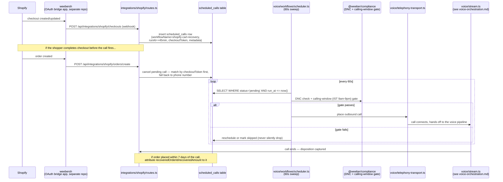
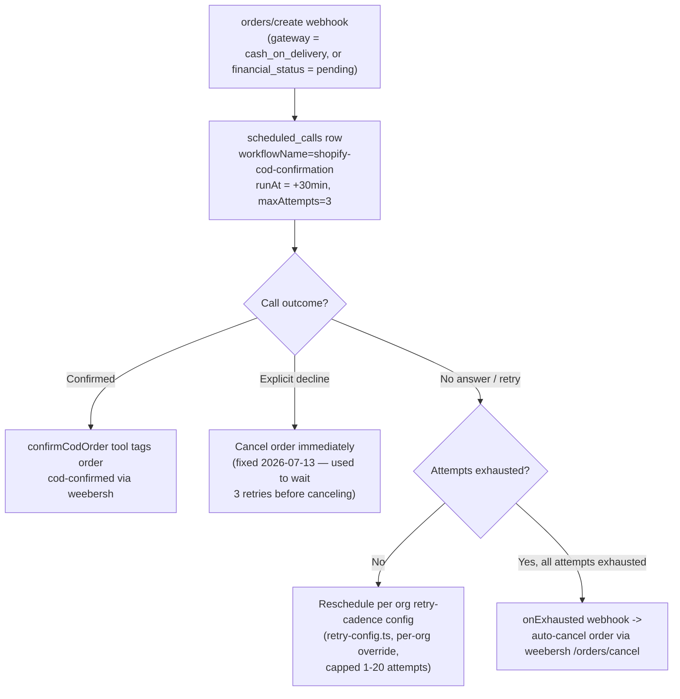

# API Flow — Shopify webhook to outbound call

How a Shopify event turns into a real outbound voice call. This is the concrete path for the
Cart Recovery and COD Confirmation agents (see `WEEBER-PLAN.md` Phase B1).

## Cart recovery, end to end

## COD confirmation — same shape, different exhaustion behavior

## Where the org boundary is enforced

Every route below `requireUserOrg` middleware (`app/routes.ts`) reads `orgId` exclusively from the
resolved session (`c.get("userOrgId")`) — never from a path param or request body. The Shopify webhook
routes resolve `orgId` from the install-time-stamped value weebersh is expected to carry through its
OAuth flow (`buildInstallUrl` → weebersh's `state` → echoed back on `/connected`); when it's missing, the
backend defensively reuses whatever org that shop was already linked to instead of minting an orphan org
— see `integrations/shopify/routes.ts`'s `resolvedOrgId` fallback logic and `WEEBER-PLAN.md`'s workstream
F for the still-open weebersh-side root cause.
