# Data Model — schema as an ER diagram

Source of truth is always `packages/api/src/database/schema.ts` — this diagram is a snapshot
(2026-07-13) grouped by concern, not every column, to stay readable. Regenerate/update this when the
schema changes significantly (new tables, not every column tweak).

```mermaid
erDiagram
    orgs ||--o{ org_members : has
    orgs ||--o{ org_agent_configs : has
    orgs ||--o{ org_workflow_configs : has
    orgs ||--o{ scheduled_calls : schedules
    orgs ||--o{ calls : places
    orgs ||--o| onboarding_state : tracks
    orgs ||--o| shop_links : "connects (Shopify)"
    orgs ||--o{ shopify_contacts : has
    orgs ||--o{ shopify_discount_codes : has

    agent_templates ||--o{ org_agent_configs : "overridden by"
    workflow_templates ||--o{ org_workflow_configs : "overridden by"
    workflow_templates ||--o{ workflow_runs : executes

    calls ||--o{ transcripts : has
    calls ||--o{ tool_calls : has
    calls ||--o| call_latency : measures
    scheduled_calls ||--o| calls : "fires into"

    orgs {
        text id PK
        text vertical "shopify | insurance | ..."
        text plan_name
        text currency
        text country_code
        text timezone
        text contact_email
        text twilio_mode "platform | own sub-account"
    }
    org_members {
        int id PK
        text supabase_user_id "unique — audit#03 race fix"
        text org_id FK
        text role "owner (no multi-seat yet — Phase C, Q)"
    }
    agent_templates {
        text id PK
        text vertical
        text default_persona_prompt
    }
    org_agent_configs {
        text org_id FK
        text template_key FK
        text voice_provider "elevenlabs | cartesia | sarvam"
        text stt_provider "deepgram | sarvam"
        text llm_provider
        text[] tools_enabled
        jsonb guardrails
        int first_call_delay_minutes "per-org retry cadence override"
        int retry_delay_minutes
        int max_attempts "capped 1-20"
    }
    scheduled_calls {
        uuid id PK
        text org_id FK
        text workflow_name
        text checkout_token "cart-recovery cancellation match"
        text recovered_order_id "revenue attribution"
        numeric recovered_amount
        timestamp run_at
        text status
    }
    do_not_call {
        int id PK
        text phone_number "unique — GLOBAL, not per-org (Phase C, item P — open)"
        text reason
    }
    workflow_templates {
        text id PK
        text vertical
        jsonb graph "nodes+edges, Workflow Canvas"
    }
    org_workflow_configs {
        text org_id FK
        text template_key FK
        boolean enabled
        jsonb overrides "per-node config overrides"
    }
    caller_memory {
        text phone_number
        text org_id FK
        jsonb facts "structured, deterministic — not RAG"
    }
    platform_admins {
        int id PK
        text role "superadmin|admin|support|finance|developer"
    }
```

## Notable absences (as of 2026-07-13 — tracked in `WEEBER-PLAN.md`)

- **No `knowledge_base`/`documents`/embedding table** — persona prompts reference a merchant-uploaded
  KB, but no such table exists yet (Phase A gap, not a differentiator gap).
- **No `org_id` on `do_not_call`** — the DNC list is global across all tenants, not per-org (Phase C,
  workstream P, hits the compliance-package confirmation gate before it's touched).
- **No multi-seat/invite table** — `org_members.role` defaults to `"owner"`, no second role/invite flow
  exists (Phase C, workstream Q).
- **No `crm_connections`/per-org-token table** — HubSpot/Salesforce/GoHighLevel/Google Calendar adapters
  all read one shared, globally-configured token per integration (Phase C, workstream R).
- **No `org_phone_numbers` table** — `orgs.outboundNumber` is a single column, one number per org, no
  per-agent assignment, no release/decommission path. Full spec for the replacement table + the
  Numbers page + the agent-page number dropdown is in `WEEBER-PLAN.md`, Phase C, workstream C2b
  (confirmed real gap 2026-07-13, not just unverified).
