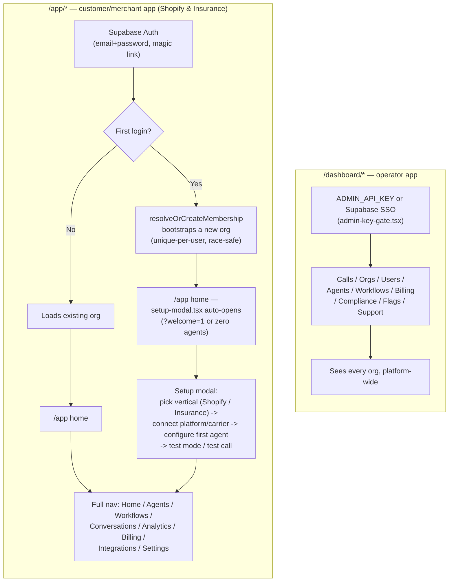
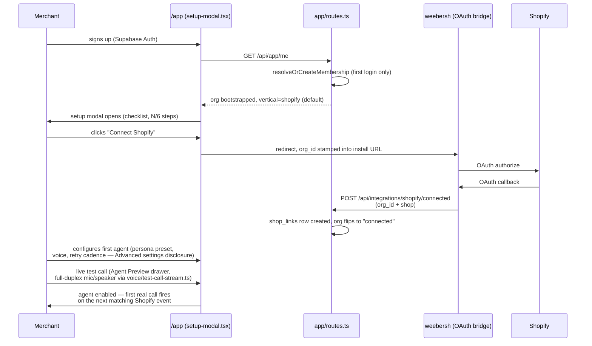
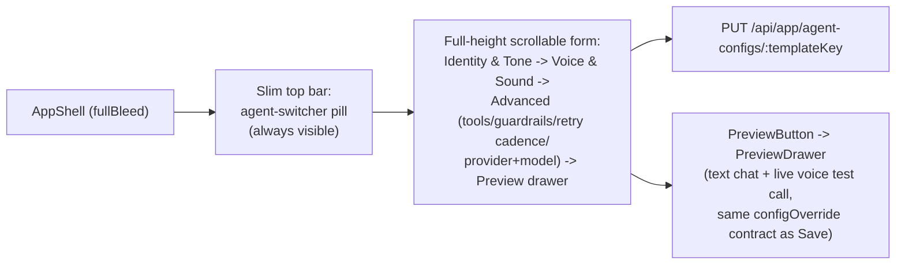

# User Flow — two apps, two audiences

Two physically separate route trees, two auth models — not one app with role-based hiding (deliberate,
matches how the earlier Vocalist frontend did it too).

## Merchant onboarding detail (Shopify vertical)

## Agent config page — full-window console (2026-07-13 redesign)

