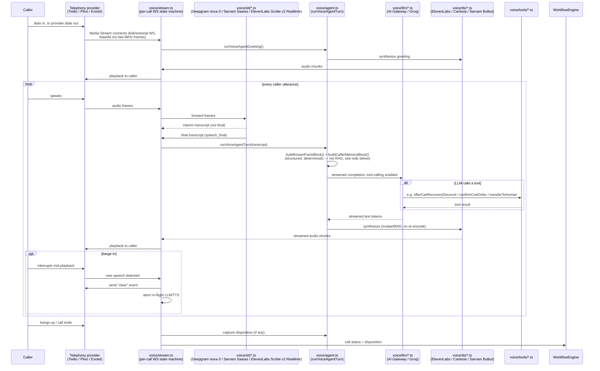
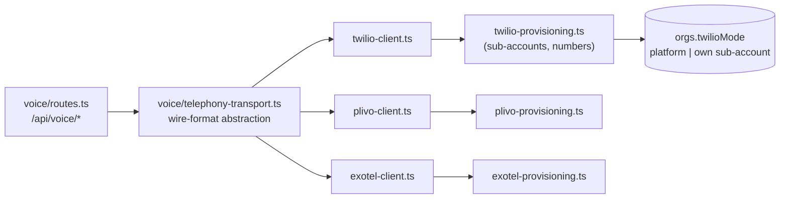

# Voice Orchestration — the call pipeline

How one call actually flows through the system, file by file. See `README.md` for the repo layout
these files live in.

## End-to-end pipeline



**Note on memory:** the "known facts" / "caller memory" blocks injected into the LLM prompt
(`buildKnownFactsBlock`, `buildCallerMemoryBlock` in `voice/agent.ts`, backed by `voice/caller-memory.ts`)
are a **structured, deterministic** memory system — not a RAG/vector-search layer. This solves a
different problem than a knowledge base (see `docs/reference/state-engine.md` for why raw-transcript/lossy-summary
memory causes agents to re-ask or contradict themselves). **Separately, a real per-vertical PDF-upload
knowledge base is referenced by the persona prompts (`docs/agent-prompts/01`, `04`) but does not exist in
the schema/backend yet** — see `WEEBER-PLAN.md`'s Phase A tracking for this gap.

## End-of-turn detection (the `speech_final` → `runVoiceAgentTurn` step)

Between "STT emits a final transcript" and "the agent answers" sits one decision: **did the caller
actually finish their turn, or pause mid-thought?** Answer too eagerly and you cut people off; wait too
long and the agent feels laggy. Today that decision is Deepgram `speech_final` (a fixed silence timeout)
refined by an `endsMidThought` regex that holds one more beat on trailing fillers ("so...", "and...", "um").

As of **Five Bets Phase V** this lives behind a pluggable seam in `voice/turn-detection/` rather than an
inline check in `stream.ts`:

```mermaid
flowchart LR
    T["speech_final transcript"] --> C{createTurnDetector<br/>(per call, from flag)}
    C -->|"flag off OR no refiner<br/>(the default today)"| H["HeuristicTurnDetector<br/>= old endsMidThought, byte-identical"]
    C -->|"flag on AND refiner wired<br/>(future)"| K["Composite"]
    K --> H2["heuristic first"]
    H2 -->|"wants to hold<br/>(mid-thought)"| Hold["hold — skip model call"]
    H2 -->|"looks complete"| B["withLatencyBudget(refiner, heuristic, 300ms)"]
    B -->|"answers in budget"| Dec["model decision"]
    B -->|"slow / throws"| H
    H --> Turn["runVoiceAgentTurn / arm silence timer"]
    Dec --> Turn
    Hold --> Wait["wait one more beat"]
```

- **`types.ts`** — the `TurnEndDetector` interface (`decide({ text }) → { done, by, reason? }`). Any
  adapter (heuristic today; Smart Turn / OpenAI Realtime / LiveKit later) implements this one method.
- **`heuristic.ts`** — `endsMidThought` + `TRAILING_FILLER_PATTERN` **moved here unchanged** from
  `stream.ts` (which re-exports `endsMidThought` for back-compat), wrapped as `HeuristicTurnDetector`.
  Zero I/O — it is both the default detector *and* the always-available fallback.
- **`budgeted.ts`** — `withLatencyBudget(primary, fallback, budgetMs)`: the guarantee that makes a
  model safe to run inline. A model that can't answer within 300ms (or throws) degrades to the heuristic —
  it can **never** add unbounded latency to the hottest line in the product. Post-timeout rejections are
  swallowed so they can't surface as unhandled rejections.
- **`composite.ts`** — runs the heuristic first; if it wants to *hold* (mid-thought) it short-circuits and
  **skips the model call** entirely (a model can't legitimately make us hold *more*). A model is consulted
  **only** when the turn looks complete — the single place semantics can prevent a wrong cut-off.
- **`index.ts`** — `createTurnDetector(config)` factory + `SEMANTIC_TURN_DETECTION_FLAG`
  (`"semantic-turn-detection"`, same co-located-constant / no-DB-column org-flag pattern as
  `expressive-delivery` and backchannels) + `DEFAULT_REFINER_BUDGET_MS` (300).

**No model is wired yet, on purpose.** Phase V ships the seam and fallback discipline only; the refiner
stays `null` until (a) Phase II call-health data shows real cut-offs to justify it and (b) staging is
isolated from prod so a model can be rolled out safely — the deferral is documented in
`docs/decisions/adr-063-*.md`. With the flag off or no refiner (today's default), `createTurnDetector`
returns a bare `HeuristicTurnDetector` and behavior is byte-identical to the old inline check. Dropping in
a real model later is one line: pass a `refiner`, flip the flag.

## Telephony provider abstraction



One org can be on Twilio (global default) or Plivo/Exotel (India-first alternative) — the abstraction
means `voice/routes.ts` and `voice/stream.ts` never branch on provider directly.

## STT/TTS provider selection today

Per-agent config (`agentTemplates`/`orgAgentConfigs`) lets an operator pick `sttProvider` (`deepgram` |
`sarvam` | `elevenlabs`) and `voiceProvider` (`elevenlabs` | `cartesia` | `sarvam`) — one fixed spoken
language per call, by design. As of **ADR-060** (see `docs/voice-quality/language-support.md`), when no
provider is explicitly chosen and `SARVAM_API_KEY` is present, Indic-language calls smart-default to
Sarvam automatically (`resolveSttProvider`/`resolveTtsProvider` + `prefersSarvam()` in `voice/stt/index.ts`,
`voice/tts/index.ts`, `voice/agent-frame.ts`); an explicit operator choice always wins, and the smart
default beats the env default but never an explicit override. `en`/`multi` are untouched.

**Mid-call spoken-language switching (detect language mid-call, flip the TTS voice, debounce noisy
detections) is REJECTED per ADR-060 — not a deferred item.** Swapping the TTS voice mid-call breaks the
agent's voice identity, adds latency, and destabilizes the call. STT *understanding* of code-mixed
Hindi/English within one call is a separate concern and is fully supported (below).

The STT/TTS *quality* half of the Hindi/Hinglish story, however, was live-verified 2026-07-16
(`docs/voice-quality/hindi-hinglish-voice-support.md`, not duplicated here): `stt/elevenlabs.ts` (new — ElevenLabs
Scribe v2 Realtime, confirmed with real audio to keep English words in Latin script mid-sentence
instead of transliterating them) and `stt/sarvam.ts` (fixed from `mode: "transcribe"` to `"codemix"`,
same live-verification approach) are both real, tested options for Hindi today — the agents-tab UI
recommends ElevenLabs as the tested default. `tts/elevenlabs.ts` also gained pronunciation-dictionary
support (`pronunciation_dictionary_locators`) for domain terms (COD, UPI, KYC, etc.) that were being
mispronounced.
