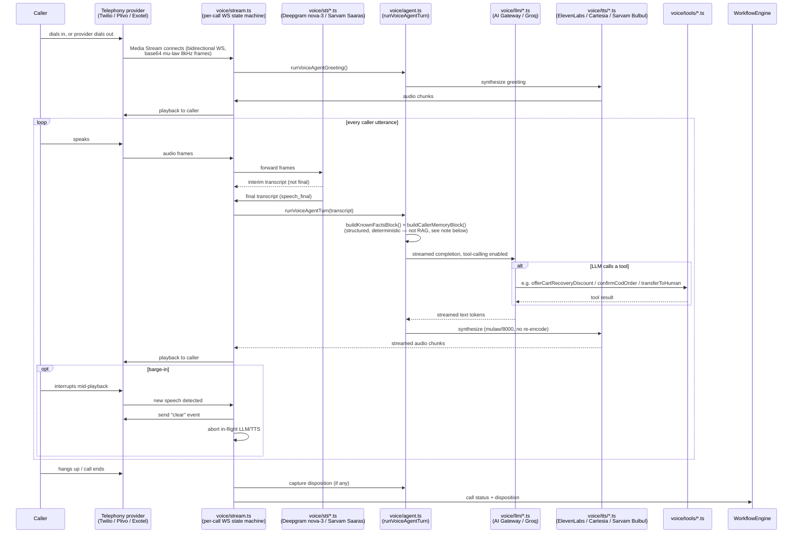
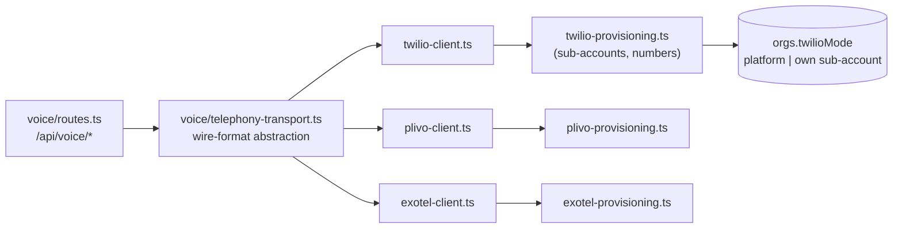

# Voice Orchestration — the call pipeline

How one call actually flows through the system, file by file. See `README.md` for the repo layout
these files live in.

## End-to-end pipeline

**Note on memory:** the "known facts" / "caller memory" blocks injected into the LLM prompt
(`buildKnownFactsBlock`, `buildCallerMemoryBlock` in `voice/agent.ts`, backed by `voice/caller-memory.ts`)
are a **structured, deterministic** memory system — not a RAG/vector-search layer. This solves a
different problem than a knowledge base (see `docs/state-engine.md` for why raw-transcript/lossy-summary
memory causes agents to re-ask or contradict themselves). **Separately, a real per-vertical PDF-upload
knowledge base is referenced by the persona prompts (`docs/agent-prompts/01`, `04`) but does not exist in
the schema/backend yet** — see `WEEBER-PLAN.md`'s Phase A tracking for this gap.

## Telephony provider abstraction

One org can be on Twilio (global default) or Plivo/Exotel (India-first alternative) — the abstraction
means `voice/routes.ts` and `voice/stream.ts` never branch on provider directly.

## STT/TTS provider selection today

Per-agent config (`agentTemplates`/`orgAgentConfigs`) lets an operator pick `sttProvider` (`deepgram` |
`sarvam`) and `voiceProvider` (`elevenlabs` | `cartesia` | `sarvam`) — **but this is one static field per
agent, not a per-call, per-language switch.** Building the actual dual-language-in-one-call behavior
(detect language mid-call, switch TTS voice, debounce noisy short-utterance detections) is tracked as
**Phase B2** in `WEEBER-PLAN.md` — the provider adapters (`stt/sarvam.ts`, `tts/sarvam.ts`) already exist,
the orchestration logic to actually switch languages inside one call does not yet.
