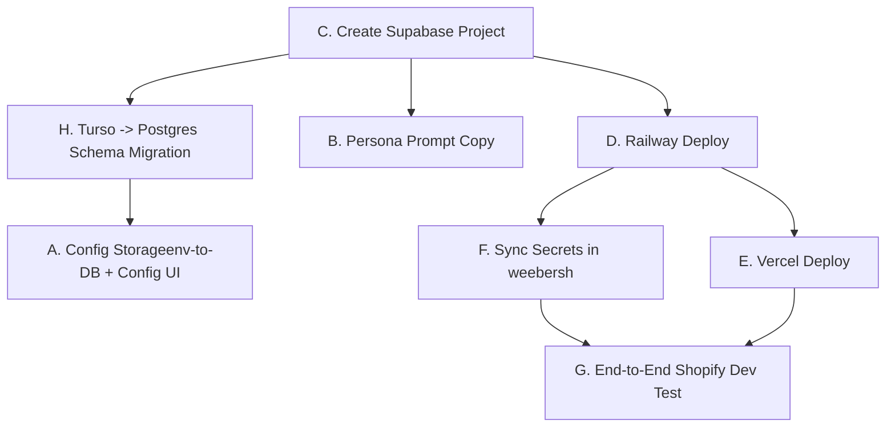

# Weeber Voice Orchestration Backend & Frontend - Codebase Analysis

This document provides a thorough architectural overview and analysis of Weeber's voice-AI codebase, following the recent physical split of the project's backend and frontend components.

---

## 1. Project Architecture & Workspace Layout
The repository is structured as a **Bun Monorepo** using workspaces, consisting of three main packages:

1. **`packages/api` (`@weeber/api`)**  
   The core voice runtime and HTTP backend. Built using **Bun, Hono, Drizzle ORM, and Twilio WebSockets**. It is deployed to **Railway** for long-lived WebSocket streaming.
   - **`src/index.ts`**: The main Hono application (exports `AppType` for RPC).
   - **`src/server.ts`**: The entry point for the Bun server, which spins up the Hono app, Twilio Media Stream WebSockets, and database sweeps.
   - **`src/database/`**: Relational schema definitions (`schema.ts`) and connection wrappers. Currently uses SQLite/libSQL but is slated to migrate to Postgres.
   - **`src/integrations/shopify/`**: Implements the webhook contract with `weebersh`.
   - **`src/voice/`**: Call logic, prompt builders, tool executables, and workflow engines.

2. **`packages/web` (`@weeber/web`)**  
   The frontend React/Vite dashboard. Deployed to **Vercel** as a static site.
   - Type-safe communication with the backend is managed via a Hono client importing `AppType` (types only) from `@weeber/api`.
   - All client calls go through [api.ts](file:///c:/Rex/openvent-main/openvent-main/packages/web/src/web/lib/api.ts) using the target endpoint determined by `VITE_API_BASE_URL`.
   - UI theme is defined via `.theme-weeber` in [styles.css](file:///c:/Rex/openvent-main/openvent-main/packages/web/src/web/styles.css) (Arc browser-inspired warm paper design).

3. **`packages/openvent-compliance` (`@openvent/compliance`)**  
   A standalone, framework-agnostic package enforcing call compliance.
   - Enforces TCPA/DNC check, GDPR right-to-erasure, calling-window time-gates, and audit trail outputs.
   - Operates entirely in memory or via simple adapters (isolated from core API/db code).

---

## 2. Relational Database Schema
Currently, the schema is written for libSQL/SQLite in [schema.ts](file:///c:/Rex/openvent-main/openvent-main/packages/api/src/database/schema.ts). Key tables and columns include:
* **`orgs`**: Keyed by `id`, contains tenant info (`name`, `vertical` default `"shopify"`, `planName`, etc.).
* **`shopLinks`**: Maps Shopify domains to `orgId`.
* **`shopifyContacts`**: Syncs Shopify customer information (scoped to `orgId`).
* **`shopifyDiscountCodes`**: Ledgers issued codes to ensure idempotency.
* **`shopifyWebhookEvents`**: Deduplicates incoming webhooks on `(shop, topic, idempotencyKey)`.
* **`calls` & `scheduledCalls`**: Scoped with `orgId` and a `metadata` JSON field for generic payload persistence.

> [!IMPORTANT]  
> **Turso to Supabase Postgres Migration (ADR-034):** Before building more schema surfaces, the database layer must migrate from SQLite to Postgres. This will allow the use of Supabase's native Row-Level Security (RLS) to enforce `orgId` separation automatically.

---

## 3. The 3 Shopify Voice Agents
Weeber implements three specific agents to automate e-commerce operations. All three schedule outbound calls via `scheduledCalls` (picked up by the background sweep in [scheduler.ts](file:///c:/Rex/openvent-main/openvent-main/packages/api/src/voice/workflows/scheduler.ts)):

| Agent | Webhook Trigger | Delay | Attempts | Tool(s) | Exhaustion Behavior |
| :--- | :--- | :--- | :--- | :--- | :--- |
| **Cart Recovery** | `checkouts/create` or `update` | 45 min | 2 | `offerCartRecoveryDiscount` | None (call is auto-canceled if `orders/create` is received first). |
| **COD Confirmation** | `orders/create` (gateway is pending/COD) | 30 min | 3 | `confirmCodOrder` | Auto-cancels order via weebersh's `/orders/cancel` endpoint. |
| **Feedback** | `orders/fulfilled` | 3 days | 1 | `captureField` (generic) | None. Feedback scores/text are saved to `capturedState`. |

---

## 4. Current Webhook Integrations (`weebersh` Contract)
Incoming webhooks from the `weebersh` proxy are processed under [routes.ts](file:///c:/Rex/openvent-main/openvent-main/packages/api/src/integrations/shopify/routes.ts):
* Authenticated using `X-Weeber-Secret` ([secret-auth.ts](file:///c:/Rex/openvent-main/openvent-main/packages/api/src/integrations/shopify/secret-auth.ts)).
* Deduplicated using an idempotency manager ([idempotency.ts](file:///c:/Rex/openvent-main/openvent-main/packages/api/src/integrations/shopify/idempotency.ts)).
* Writes to Shopify are handled via the client ([client.ts](file:///c:/Rex/openvent-main/openvent-main/packages/api/src/integrations/shopify/client.ts)) using the shared `X-Weeber-Callback-Secret`.

---

## 5. Immediate High-Priority Workstreams
Based on [WEEBER-PLAN.md](file:///c:/Rex/openvent-main/openvent-main/WEEBER-PLAN.md), our roadmap is structured into parallelizable streams:

1. **Turso to Postgres Migration (Workstream H)**  
   Requires a Supabase project instance (C). Switch Drizzle dialect to `"postgresql"`, rewrite schemas using `pgTable` types, migrate connection drivers, and configure RLS.
2. **Config Storage (Workstream A)**  
   Move persona prompts (`AGENT_PERSONAS`) and workflow configs (`WORKFLOWS`) from hardcoded environment JSON into DB tables (`personaConfigs`, `workflowConfigs`) keyed by `orgId`. Build the merchant dashboard config forms.
3. **India Compliance Review (Workstream I)**  
   Outbound voice campaigns in India must adhere to TRAI guidelines (NDNC registry registry checking, 9 AM - 9 PM IST calling windows, and 140-series telemarketing numbers/headers).
4. **Merchant Auth (Supabase Auth)**  
   Create a `users_to_orgs` mapping table to link Supabase User IDs to their respective `orgId` instances. Set up auth middleware on `/app/*` routes.
