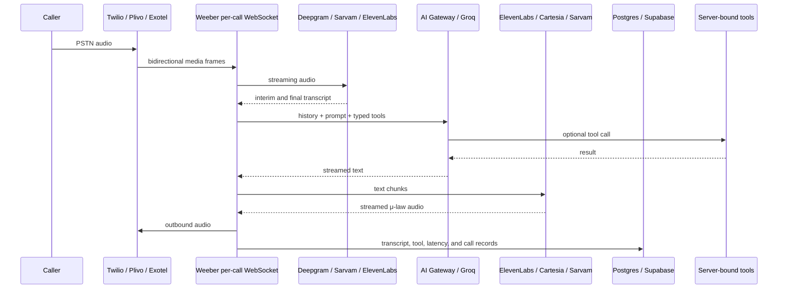
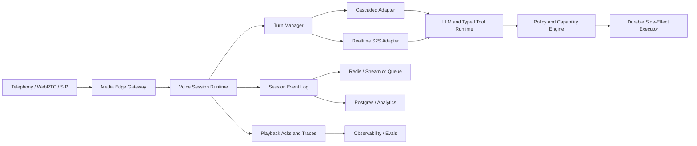

# Weeber vs. State-of-the-Art Voice-Agent Architectures

**Date:** 2026-08-16
**Auditor:** Manus AI — external, AI-authored architecture assessment (not a Weeber-team internal audit)
**Scope:** Backend architecture, realtime media path, model orchestration, telephony, state, reliability, observability, scaling, and engineering trade-offs. Product feature comparison intentionally excluded.
**Repo state at audit:** `main` @ `1f06ebb`, verified in sync with `origin/main` at import time.
**Method:** Grounded in the local checkout, source files, architecture notes, deployment configuration, and dated repository audits (`audit-13`, `audit-17`). Competitive comparison uses primary vendor documentation retrieved 2026-08-16 and is treated as reported vendor guidance, not independently reproduced benchmarks.
**Verification:** Spot-checked against this repo before archiving — all 11 cited source paths and both cited dated audits exist; `ecosystem.config.cjs` confirms the single-PM2-fork claim; `session-store.ts` confirms the Redis-opt-in dual-mode claim; `audit-13` confirms the 1.67s/1.59s latency figures and the `speech_final`/`UtteranceEnd` 700ms endpointing gap verbatim. Nothing found to be fabricated or repo-mismatched.
**Baseline:** n/a — first document of this kind archived here.

---

> **Note on provenance:** This assessment was produced externally (Manus AI) and imported as-is after fact-checking its citations against the live repo. Treat its architecture recommendations as planning input to weigh against `docs/decisions/` ADRs and the team's own dated audits, not as a decision already made. Vendor latency figures throughout (LiveKit, Vapi, etc.) are vendor-reported, not measured head-to-head against Weeber.

## CTO, Developer, and Software-Architecture Assessment

**Prepared by:** Manus AI
**Date:** 16 August 2026
**Repository reviewed:** `Aurora-091/weeber`, current local `main` checkout at `1f06ebb`
**Scope:** Backend architecture, realtime media path, model orchestration, telephony, state, reliability, observability, scaling, and engineering trade-offs. Product feature comparison is intentionally excluded.

**Method and confidence:** The Weeber assessment is grounded in the local checkout, source files, architecture notes, deployment configuration, and dated repository audits. The competitive assessment uses primary vendor documentation retrieved on 16 August 2026. Vendor latency figures and capability descriptions are treated as **reported architecture guidance**, not as independent benchmark results. Weeber's historical production figures are clearly labeled as dated repository evidence, and no new external provider benchmark was run because the local environment does not contain the required provider credentials.

> **Executive judgment:** Weeber is already a serious, domain-aware cascaded PSTN voice system, but it is not yet state-of-the-art as a general-purpose voice-agent runtime. Its strongest assets are deterministic business state, compliance controls, workflow execution, provider abstraction, and a large amount of production hardening. Its weakest areas are the realtime hot path, model/runtime observability, turn detection, session portability, provider-session reuse, and tool-call correctness under failure. The correct strategy is **not a full rewrite**. Preserve Weeber's control plane and domain layer, while replacing or isolating the media/session runtime behind a stronger event-driven interface that can support both cascaded STT → LLM → TTS and native speech-to-speech.

## 1. Executive Summary

Weeber implements a conventional but capable **cascaded voice pipeline**. Telephony audio arrives through Twilio, Plivo, or Exotel; a per-call WebSocket state machine forwards audio to streaming STT; finalized text is sent to a streamed LLM turn; text deltas are segmented into streaming TTS; and encoded audio is sent back to the caller. This is the same fundamental pipeline used by major realtime frameworks because it is modular, inspectable, and suitable for regulated workflows. LiveKit describes the canonical form as Audio → VAD → STT → LLM → TTS → Audio and emphasizes that streaming across stage boundaries is what reduces perceived latency.[2]

The difference is that leading frameworks and platforms have made the **runtime substrate** itself a first-class product. LiveKit provides stateful realtime sessions, WebRTC/SIP media, agent-server dispatch, load balancing, job isolation, graceful draining, and restart-aware lifecycle management.[1] [17] Pipecat exposes a frame-processing pipeline with high-priority interruption/control frames, ordered queues, parallel branches, and separate runner/bot processes.[3] [4] Retell and Vapi externalize most of the hard media and turn-taking work and expose a custom LLM protocol or server endpoint.[12] [14] ElevenLabs provides an integrated STT, LLM, TTS, and proprietary turn-taking model.[16] OpenAI Realtime collapses the speech path into a stateful audio-native session with server or semantic VAD, interruption controls, function calling, and SIP connectivity.[5] [6] [7] [8]

Weeber therefore competes in two different markets simultaneously. It is an **application/control plane** similar to an insurance, commerce, and workflow platform, but it also attempts to be a **voice media runtime** similar to LiveKit, Pipecat, Retell, Vapi, ElevenLabs, or OpenAI Realtime. It is relatively strong in the first role and materially behind the state of the art in the second. The architectural recommendation is to separate these roles.

| Dimension | Weeber today | State-of-the-art direction | CTO assessment |
|---|---|---|---|
| Runtime | Bun `Bun.serve`, Hono, native WebSockets, one per-call closure/state machine | Session/job runtime with explicit lifecycle, dispatch, isolation, and drain semantics | Good prototype-to-production foundation, but the process topology is too coupled for large-scale realtime operation |
| Media path | PSTN media streams, mainly 8 kHz μ-law, provider adapters | WebRTC/SIP/media routers with jitter, interruption, playback, and session primitives | Functional and provider-flexible, but Weeber owns too much low-level timing code |
| Voice architecture | Cascaded STT → LLM → TTS | Cascaded runtime plus optional audio-native S2S | Keep cascade for compliance and tools; add S2S as a bounded adapter for latency-sensitive turns |
| Turn detection | Deepgram `speech_final`, `utterance_end`, heuristic mid-thought detector; semantic refiner not wired | Semantic EOT/VAD, configurable eagerness, interruption state, provider-native turn models | Major gap in naturalness and latency |
| LLM layer | Vercel AI Gateway or direct Groq; streamed text and typed tool calls | Direct realtime model sessions, or runtime-managed streaming with actual model attribution | Flexible, but current telemetry cannot reliably show which transport/model served every turn |
| TTS lifecycle | Provider abstraction and failover, but TTS connection is per turn | Persistent or pre-warmed provider sessions, audio chunk scheduling, playback acknowledgements | Likely avoidable latency and connection churn |
| State | In-memory by default; Redis opt-in; Postgres durable records | Process-independent session state plus event log and explicit job ownership | Adequate for one instance; unsafe default for horizontal realtime scaling |
| Reliability | STT/TTS failover, LLM fallback, retries, webhook outbox, Sentry | Runtime-level reconnect, dispatch, drain, restart, and circuit-breaker semantics | Strong application-side effort; incomplete runtime-level guarantees |
| Tool safety | Server-bound tools, capability filtering, output guard, prohibited-capture and outbound-text guards | Typed event protocol, deterministic side-effect executor, capability-aware prompts, replayable tool traces | Good intent and significant hardening, but dated audits show P0 failure modes still existed |
| Observability | DB latency tables, transcripts, tool calls, Sentry, health route | Per-session traces, actual provider/model labels, audio playback marks, evals, log drains | The instrumentation is thoughtful but not yet trustworthy enough for optimization decisions |
| Compliance and domain control | Stronger than most generic runtimes | Usually supplied through application layer or platform configuration | Weeber's primary differentiator; preserve it |

## 2. What Weeber Actually Is

### 2.1 Runtime topology

The backend entry point is `packages/api/src/server.ts`. It initializes Sentry, compliance preflight checks, retention sweeps, scheduled-call sweeps, a webhook-outbox worker, template seeding, and one `Bun.serve` instance. That server multiplexes HTTP API requests and several WebSocket kinds, including voice media streams, test calls, and waitlist traffic. The voice WebSocket is upgraded by `voice/ws-route.ts` and dispatched to `createVoiceStreamHandlers()` in `voice/stream.ts`.

The live call is represented by a large per-call closure. The state machine holds the call SID, stream SID, database call ID, provider overrides, active STT/TTS connections, LLM history, captured state, caller memory, pending transfer/hang-up actions, silence timers, turn counters, latency timers, and failure counters. This design is easy to follow locally because all call state is close to the media events. It is also the main scaling constraint: session ownership, media handling, side effects, model orchestration, and operational bookkeeping are coupled inside one process-level unit.

The documented call path is:

This is a valid production architecture. Its limitation is not that it uses STT, LLM, and TTS separately; cascaded pipelines remain attractive because each stage is independently swappable, auditable, and debuggable.[2] The limitation is that Weeber currently implements much of the runtime coordination manually and measures several boundaries incompletely.

### 2.2 Control plane and application plane

Weeber has considerably more than a voice loop. Its API surface includes inbound and outbound call initiation, telephony callbacks, number provisioning, agent configuration, prompt/test surfaces, synthetic testing, analytics, workflows, CRM synchronization, Shopify-related tools, knowledge-base ingestion, compliance, DNC/consent handling, and operational audit routes. The database schema includes calls, transcripts, tool calls, call and turn latency, workflow runs, caller memory, knowledge documents/chunks, webhook outbox rows, and organization-level agent configuration.

The webhook system uses an outbox pattern: events are persisted before delivery, claimed with a compare-and-set status update, retried with exponential backoff, and moved to a dead state after repeated failure. This is a real strength. It means the call does not depend on a downstream n8n, Zapier, Make, CRM, or customer webhook being available at the exact moment a call event occurs. The implementation is in `packages/api/src/voice/webhooks.ts`.

Weeber's session store is intentionally dual-mode. It uses a process-local `Map` by default and a Redis-backed implementation when `REDIS_URL` is configured. The code explicitly states that Redis is required when more than one instance needs shared session state. The practical problem is that the deployment configuration still defaults to one PM2 fork and does not pin a production region. That is acceptable for an early single-instance system, but the default path is not the same as a horizontally scalable realtime runtime.

### 2.3 Prompt, memory, and tool model

The LLM layer composes a persona with call-control instructions, workflow facts, caller memory, and structured facts captured during the current call. The distinction between **workflow context**, **prior-call memory**, and **confirmed facts from the current call** is a sound software decision. It prevents the common error of treating an old memory or a pre-call workflow assumption as if the caller had just confirmed it.

The tool registry is also server-bound. Tools such as `lookupInfo`, `bookAppointment`, `captureField`, `crmSync`, `sendSms`, `sendDtmf`, `hangUp`, and `transferToHuman` are registered based on the organization, workflow context, and enabled-tool configuration. Some tools are wrapped with timeouts, filler timers, and outbound-content guards. This is much better than giving a model arbitrary network or database access.

However, the tool design currently relies on the LLM provider correctly recognizing and emitting the AI SDK's structured tool-call channel. The dated Audit 17 in the repository records cases where tool syntax was spoken as ordinary text, false transfer promises were made when the transfer capability was absent, and a fabricated booking confirmation was spoken without a corresponding tool execution. The same audit later notes that production provider/model attribution was insufficient to determine exactly which route served the malformed turns. These are not merely prompt-quality issues. They are runtime observability and capability-contract issues. The corrective principle is: **a tool call must be an event with a validated schema and execution receipt, never a string that can fall through to TTS**.

## 3. Competitive Architecture Landscape

The relevant competition should be divided into four technical categories rather than treated as one homogeneous market.

### 3.1 Realtime frameworks: LiveKit Agents and Pipecat

LiveKit Agents is a session-oriented framework in which a Python or Node.js agent joins a LiveKit room as a realtime participant. It supports WebRTC, telephony, streaming STT/LLM/TTS pipelines, tools, handoffs, turn detection, and model plugins. Its deployment model registers agent servers, dispatches jobs, isolates sessions, load-balances requests, and gracefully drains active sessions during deployment.[1] [17] This is a direct benchmark for the runtime layer Weeber is building.

Pipecat takes a different but equally strong approach. It models the call as a pipeline of frame processors. Audio, transcripts, LLM deltas, TTS audio, interruptions, errors, and shutdowns are represented as frames. System frames receive higher priority than ordinary data/control frames, and processing order is guaranteed within each lane. Its runner separates session initialization from the bot service and supports WebRTC, Daily, and telephony WebSockets.[3] [4]

| Runtime concern | Weeber | LiveKit Agents | Pipecat |
|---|---|---|---|
| Primary abstraction | Per-call closure/state machine | `AgentSession` plus dispatched job | Frame pipeline plus processors |
| Media transport | Telephony provider media WebSocket | LiveKit WebRTC, SIP, telephony | WebRTC, Daily, Twilio/telephony WebSocket transports |
| Interruption | Hand-coded barge-in and abort logic | Framework interruption event and playback cancellation | High-priority interruption/system frames |
| Session lifecycle | Managed inside one Bun process | Agent server registration, job dispatch, graceful drain, redispatch | Runner and per-session bot process model |
| Parallelism | Mostly manual asynchronous operations | Runtime/job controlled | Explicit parallel pipeline branches |
| Best fit | Domain-specific PSTN application with custom controls | Production realtime media and multi-modal agents | Highly programmable audio/event pipelines |
| Weeber lesson | Split control plane from media runtime | Adopt explicit session/job ownership | Introduce typed events and priority lanes |

### 3.2 Managed orchestration platforms: Vapi, Retell, and ElevenLabs

Vapi provides a managed voice-agent platform with assistants, multi-assistant squads, telephony, WebRTC, tools, custom LLMs, provider selection, endpointing controls, fallbacks, testing, monitoring, and external observability integrations. Its documented pipeline includes VAD, transcription, a start-speaking decision, LLM, TTS, and audio output. It supports smart endpointing, interruption thresholds, provider fallbacks, and a custom server route when developers need to own response generation.[9] [10] [11] [12] [13]

Retell's custom LLM interface is a particularly useful comparison because it cleanly separates media runtime from application intelligence. Retell handles telephony, transcription, turn-taking, and speech synthesis. A customer WebSocket receives live transcripts and `response_required` events, and streams back response content, tool bookkeeping, transfer instructions, DTMF actions, or end-call signals. Retell explicitly warns that it may discard a response if the user continues speaking, and it provides response IDs to make this cancellation model explicit.[14] [15]

ElevenLabs ElevenAgents coordinates four core components: a fine-tuned STT model, a selected or custom LLM, low-latency TTS, and a proprietary turn-taking model. It also exposes knowledge, tools, telephony, WebSocket integration, testing, experiments, analytics, retention controls, and OpenTelemetry traces.[16] The important architectural lesson is not simply voice quality. It is the degree to which turn-taking, observability, testing, and deployment are treated as part of the runtime rather than left to each customer application.

| Managed-platform concern | Weeber | Vapi | Retell custom LLM | ElevenAgents |
|---|---|---|---|---|
| Media ownership | Weeber owns the live media loop | Platform-owned | Platform-owned | Platform-owned |
| Custom intelligence | Full local agent loop | Custom LLM endpoint or provider selection | Custom LLM WebSocket | Custom LLM and tools supported |
| Turn-taking | Weeber heuristic plus provider signals | Configurable smart/heuristic endpointing | Retell decides when response is required | Proprietary turn-taking model |
| Tool execution | Weeber executes tools locally | Platform tools, custom tools, server tools | Custom server must implement tool behavior and report events | Platform/client/webhook/MCP tools |
| Failure contract | Custom abort/failover logic | Provider fallback plans | Response IDs, keepalives, reconnect | Managed platform controls |
| Observability | DB rows and Sentry | Built-in monitoring/evals plus Langfuse integration | Call transcript and event protocol | Testing, evals, analytics, OpenTelemetry |
| Main trade-off | Maximum control, maximum runtime burden | Faster delivery, less low-level control | Strong media layer, custom model ownership | Strong voice/agent layer, more platform dependency |

### 3.3 Audio-native speech-to-speech: OpenAI Realtime

OpenAI Realtime is not a faster version of Weeber's existing pipeline; it is a different computational shape. A Realtime Session is stateful and contains session configuration, conversation items, and responses. Audio can be sent over WebRTC or WebSocket, and the model emits audio deltas directly. VAD is enabled by default for speech-to-speech sessions and can use server VAD or semantic VAD. The session can interrupt an active response when new user speech arrives.[5] [6] [7]

OpenAI's Realtime API also supports function calling, server-side events, response cancellation, and SIP. For telephony, a SIP trunk can point to an OpenAI SIP endpoint; an incoming-call webhook can accept or reject the call, configure the realtime session, open a control WebSocket, refer the call, or hang it up.[8] This removes much of the STT/TTS media plumbing from the application, but it does not eliminate the need for a durable tool executor, audit layer, consent policy, and business workflow engine.

| S2S trade-off | Audio-native Realtime | Weeber cascaded pipeline |
|---|---|---|
| Latency potential | Lower because audio input and output are handled in one stateful model session | Higher because endpointing, STT, LLM, and TTS stages are separate |
| Debuggability | Audio-native behavior is harder to decompose; transcript/events remain essential | Strong stage-by-stage visibility, assuming instrumentation is accurate |
| Provider flexibility | Lower; strongly coupled to the realtime model provider | High; STT, LLM, and TTS can be swapped independently |
| Tool maturity | Improving; event protocol must be integrated carefully | Mature typed LLM tools, but provider parsing must be enforced |
| Compliance | Requires explicit transcript, audio, retention, and tool audit design | Easier to audit each text boundary, but still requires privacy controls |
| Voice identity | Native model voice, less arbitrary provider mixing | Custom STT/TTS voices and language routing |
| Recommended use | Simple, low-latency, natural exchanges and web/mobile voice | Regulated, tool-heavy, multi-provider, workflow-driven calls |

## 4. Developer View: How the Systems Differ in Code

From a developer perspective, Weeber's primary pattern is **imperative orchestration**. The stream handler receives provider events and decides what to do next. This produces excellent local control: it can delay hang-up until a closing line has played, screen a capture before persistence, serialize transcript writes, cancel an in-flight turn, or select a failover provider. The cost is that every new concurrency edge case becomes another state variable, timer, abort path, or defensive callback in the same large module.

LiveKit and Pipecat move toward **declarative dataflow plus explicit lifecycle**. A developer composes a session or pipeline and lets the runtime own queueing, interruption propagation, transport lifecycle, and job management. This reduces application code in the hot path and makes provider substitution more uniform. The risk is that the developer must understand the framework's scheduling semantics, frame priorities, job model, and provider plugin contracts.

Retell and Vapi move further toward **protocol integration**. The developer writes a server that answers a defined request/response protocol. This is attractive for Weeber's business logic because it would allow the current control plane and tool executor to remain the source of truth while delegating media and turn-taking. The downside is that some decisions become platform decisions; a custom server still has to handle cancellation, keepalives, idempotency, response IDs, and partial responses correctly.

OpenAI Realtime uses an **event-sourced session protocol**. The application listens to events such as speech start/stop, response deltas, response completion, function calls, and rate-limit changes, and sends session updates, audio buffer events, response creation, cancellation, and tool results. This is efficient but demands a disciplined event reducer and durable correlation IDs. It should not be connected directly to Weeber's existing database side effects without an intermediate session event layer.

## 5. CTO and Software-Architecture Assessment

### 5.1 Latency: Weeber's main technical gap

The repository's dated latency audit reports a median of approximately **1.67 seconds** for its voice-to-voice metric across a small sample, while noting that the metric starts at receipt of Deepgram `speech_final` and ends at the first TTS byte reaching Weeber—not at the caller's ear. The same audit reconstructed approximately **2.17–2.27 seconds** of mouth-to-ear latency after adding endpointing and PSTN egress estimates. A later repository audit reports a **1.59-second p50** over 72 turns, again with caveats about confounding and incomplete attribution. These numbers are repository evidence, not an independently reproduced benchmark.

The breakdown is instructive. The audit records approximately 300–1,000 ms of endpointing delay, roughly 122 ms of Weeber pre-LLM overhead, approximately 1,288 ms of LLM time to first token in the earlier sample, approximately 355 ms from LLM TTFT to first TTS byte, and an unmeasured PSTN/Twilio egress tail. It also identifies that the TTS connection is created per turn, so a fresh provider handshake may be serialized behind the first LLM token instead of being overlapped with LLM prefill.

The competitive target should not be copied from marketing claims without normalization. LiveKit's architecture article describes roughly 400–800 ms for a streamed cascaded pipeline and 200–300 ms for speech-to-speech, while Vapi's documentation describes sub-600 ms response goals and provides configurable endpointing plans.[2] [9] Those are vendor-reported or vendor-authored figures, not apples-to-apples measurements against Weeber. Nevertheless, they identify the correct engineering direction: reduce hidden endpointing delay, overlap stage work, reuse connections, and measure the time at which audio is actually acknowledged as played.

| Latency problem in Weeber | Why it happens | State-of-the-art remedy |
|---|---|---|
| Endpointing is partly hidden from the dashboard | Clock starts at `speech_final`, not at last caller audio | Persist last-audio timestamp and endpoint signal; add semantic EOT with a strict budget |
| TTS first byte includes connection cost | TTS is per turn rather than persistent/pre-warmed | Hold a call-scoped connection or pre-open during LLM prefill, with keepalive and failure detection |
| Prompt/tool prefill is large | Long personas and broad tool schemas are sent repeatedly | Stable-prefix ordering, prompt caching, vertical-specific tool sets, compact instruction layers |
| LLM TTFT is dominant | Gateway/model/provider path and tool rounds add delay | Measure actual model per turn; route simple turns to low-latency models and complex turns to stronger models |
| DB work can enter the hot path | Transcript and state operations can occur between STT finalization and LLM request | Make nonessential writes asynchronous but ordered; use an event buffer and durable append worker |
| Caller hears beyond the first TTS byte | PSTN and jitter-buffer delivery is after current stopwatch | Use provider playback `mark`/ack events and report mouth-to-ear boundaries |
| Greeting can wait on an LLM | Literal greeting fast path is conditional and had historical misses | Always have a deterministic, tag-safe greeting fallback before model invocation |

The latency objective should be expressed as **end-of-speech to first audible agent byte**, with separate p50/p95 for endpointing, model TTFT, TTS first byte, media egress, and playback acknowledgement. A single `voiceToVoiceMs` number is insufficient for engineering decisions.

### 5.2 Turn-taking and barge-in

Weeber has more turn-taking code than a simple prototype: interim transcript handling, silence timers, a mid-thought heuristic, barge-in streak logic, backchannels, noise filters, high-pass filtering, and abort controllers. This is good engineering effort, but it is also a sign that the application is recreating a runtime subsystem.

The key limitation is that the semantic turn detector seam exists but no model refiner is wired by default. The default path remains a heuristic around `speech_final` and trailing fillers. OpenAI's Realtime API exposes server VAD and semantic VAD with configurable eagerness; Vapi exposes smart endpointing and explicit start/stop speaking plans; LiveKit provides a turn-detection model; ElevenLabs positions proprietary turn-taking as a core component.[6] [10] [16] Weeber should adopt the same separation: VAD, end-of-turn classification, interruption policy, and playback cancellation should be explicit services with measured contracts rather than tightly interleaved stream logic.

### 5.3 Reliability and horizontal scaling

Weeber has several strong reliability patterns: provider failover, abortable turn execution, turn timeouts, fallback speech, retry-wrapped database updates, serialized transcript writes, Sentry initialization, retention sweeps, and an outbox for webhooks. The use of capability-bound tools and server-side guards is also a strong security posture.

The main gap is **runtime-level failure ownership**. A live call is represented by process-local state unless Redis is configured. The deployment uses a single PM2 fork. There is no visible agent-server registration, job dispatcher, session lease, graceful drain protocol, or automatic redispatch equivalent to LiveKit's model. LiveKit explicitly advertises capacity-aware dispatch, per-job process isolation, graceful drain, and redispatch after agent disconnect.[17] [18]

This does not mean Weeber must adopt LiveKit wholesale. It means the production system needs equivalent semantics: one authoritative session owner, a lease or fencing token, resumable call state, explicit media reconnect behavior, and a deployment drain strategy. A load balancer alone cannot solve realtime session ownership.

### 5.4 Tool correctness and action safety

Weeber's desired tool architecture is better than a prompt-only agent. Tool definitions are server-created, context-bound, optionally narrowed, timeout-gated, logged, and guarded at the side-effect boundary. The implementation correctly recognizes that screening only the tool declaration is insufficient; the final point where a phone number, text, CRM note, or sensitive field becomes durable or external must be screened.

The dated production audit shows why a stronger contract is necessary. A model can still emit a malformed tool name, a text-form tool expression, or a promise about a capability removed from its tool list. Output regexes are useful defense in depth but cannot be the primary safety mechanism because model serialization dialects vary. The runtime should use the following invariant:

> **No tool-like payload may reach TTS unless it has passed schema validation, capability validation, execution policy, and an explicit natural-language rendering step.**

The implementation should therefore separate **model output** from **spoken output**. A turn should produce a typed event stream such as `assistant_text`, `tool_call_requested`, `tool_call_rejected`, `tool_call_started`, `tool_call_succeeded`, `tool_call_failed`, and `assistant_audio`. Only `assistant_text` and approved deterministic system lines should be eligible for TTS. A parser should never attempt to infer a tool call from ordinary assistant text after the fact.

### 5.5 Observability and the ability to know what happened

Weeber has unusually good instincts around observability: call-level and turn-level latency tables, token usage hooks, transcripts, tool calls, guardrail events, call health classification, provider failover counters, Sentry, and an audit directory containing dated investigations. The problem is that some of the most important fields are not yet ground truth.

The repository audits specifically identify that the configured LLM provider is written to the call record, but the actual provider/model serving a given turn is not reliably persisted. That makes provider comparisons, failover analysis, and incident reconstruction unsafe. The same issue exists in the latency metric when it excludes endpointing and media playback. A SOTA system should record a trace for every turn with stable IDs and the following minimum fields:

| Trace field | Required value |
|---|---|
| Deployment | Build SHA, boot time, region, runtime version |
| Call | Call ID, telephony provider, stream ID, session owner |
| Audio | Codec, sample rate, last audio frame, speech start, speech stop, playback mark |
| Turn | Turn ID, response ID, interruption ID, endpoint signal, detector decision |
| Model | Actual transport, provider, model, fallback index, finish reason |
| Timing | Endpoint delay, queue delay, TTFT, tool latency, TTS socket-open, TTS first byte, first playback ack |
| Tools | Requested schema, validated arguments, policy result, execution receipt, final outcome |
| State | Prompt/version ID, tool-set hash, workflow version, memory version |
| Quality | Empty turn, fallback line, interruption, hallucinated action, user correction, outcome |

Vapi's documented monitoring, evaluations, structured outputs, and Langfuse integration, ElevenLabs' testing/analytics/OpenTelemetry features, and LiveKit's session logs and log drains demonstrate that observability is treated as a core product surface by competitors.[13] [16] [18] Weeber has the raw ingredients, but it must make the data authoritative before it can optimize confidently.

## 6. Architecture Decision: What Weeber Should Become

### 6.1 Recommended target architecture

The recommended target is a **hybrid, runtime-agnostic voice platform**. Weeber should remain the owner of organizations, agent configuration, compliance, workflows, tools, state, CRM/commerce integration, billing-related metering, and post-call records. The media/session runtime should become a replaceable subsystem with a strict contract.

The **Media Edge Gateway** should terminate carrier-specific signaling and normalize audio into an internal format. The **Voice Session Runtime** should own session lifecycle, connection ownership, cancellation, backpressure, interruption, and provider reconnects. The **Turn Manager** should receive audio and emit typed turn events. The **Cascaded Adapter** should preserve Weeber's current multi-provider STT/LLM/TTS path. The **Realtime S2S Adapter** should support OpenAI Realtime or another audio-native provider for low-latency conversational paths. The policy engine and side-effect executor should remain under Weeber's control.

This design allows Weeber to choose the right architecture per call. A regulated insurance workflow with many structured fields, audit requirements, and deterministic confirmation may use the cascaded path. A short appointment-confirmation or FAQ turn may use S2S. The switch should be a runtime policy decision, not a rewrite of the application.

### 6.2 Preserve versus replace

| Keep in Weeber | Refactor behind interfaces | Consider replacing or delegating |
|---|---|---|
| Organization, agent, and workflow models | `VoiceSession`, `Turn`, `AudioFrame`, `ToolEvent`, and `PlaybackEvent` types | Provider-specific WebSocket handling inside `stream.ts` |
| Compliance, consent, DNC, retention, and guardrails | Prompt compiler and capability policy | Manual endpointing as the only default decision |
| Structured captured state and caller memory | Tool execution and durable side-effect receipts | Per-turn TTS connection lifecycle |
| Knowledge base and business integrations | Webhook/outbox event contracts | One-process assumption for live sessions |
| Post-call analytics and workflow resumption | Provider adapters and failover policy | Untrusted model-to-TTS fallback path |
| Existing UI/control plane | Trace schema and evaluation harness | Direct optimization from configured-provider fields |

## 7. Prioritized Roadmap to SOTA

### Phase 0: Make production truth measurable

The first priority is not a new model. It is measurement correctness. Add build SHA, deployment region, runtime boot time, actual LLM transport/model per turn, LLM failover index, endpoint signal, last-audio timestamp, TTS socket-open duration, and provider playback acknowledgement. Replace the current single latency headline with a trace-derived latency waterfall. This work is a prerequisite for every subsequent model or transport decision.

At the same time, make the greeting path deterministic and ensure that an unavailable transfer capability changes both the tool set and the runtime prompt. A model must never be allowed to promise a transfer, appointment, or callback unless the corresponding capability is live and its execution result is available.

### Phase 1: Fix the hot path without changing the product

The next phase should reduce latency in the current cascade. Keep STT connections call-scoped. Make TTS call-scoped or pre-warmed during LLM prefill, with keepalive and a health check so that an idle socket is not mistaken for a functioning provider. Remove cross-region database work from the critical turn path while preserving ordered durable writes through an event queue. Prune tools by vertical and workflow rather than sending all tools to every turn. Reorder prompts so stable instructions and schemas form a cacheable prefix and volatile caller facts are appended last.

Add semantic end-of-turn detection behind a strict budget, for example 200–300 ms, with an unconditional heuristic fallback. The model must never be able to add unbounded latency to the hottest line in the call. Instrument barge-in as a state transition with explicit cancellation and playback clearing rather than as several independent booleans and timers.

### Phase 2: Introduce a runtime contract

Create a `VoiceRuntime` interface with implementations for the current Weeber cascade, LiveKit/Pipecat-style session processing, and OpenAI Realtime. The interface should define session start/stop, audio input, speech events, agent text/audio events, interruption, tool calls, side-effect receipts, and playback acknowledgements. The rest of the application should not know whether a turn came from Deepgram + Groq + Cartesia or from a single audio-native model.

For the first implementation, the least disruptive option is to preserve the existing cascade and extract it from `stream.ts`. The next adapter can either use LiveKit Agents/Pipecat for the media runtime or connect to OpenAI Realtime through WebSocket/SIP. A managed platform such as Retell or Vapi is useful as a benchmark and as a potential fast-to-market transport option, but should not become the sole source of truth for Weeber's compliance and business side effects.

### Phase 3: Production-scale session infrastructure

Move from process-local session ownership to a lease-based session registry. Redis should hold ephemeral session metadata, locks, provider connection state, and cancellation tokens; Postgres should hold durable call state and audit records; a queue or stream should carry ordered session events and noncritical writes. Each live session should have a fenced owner so that a reconnect or duplicate worker cannot execute the same irreversible tool twice.

Deploy dedicated media workers separately from the dashboard/control API. Add capacity-aware dispatch, regional placement, graceful drain, concurrency limits, cold-start measurement, provider circuit breakers, and a controlled canary rollout. This is the point where the system should adopt LiveKit-like lifecycle guarantees even if it does not adopt LiveKit itself.[17] [18]

### Phase 4: Quality engineering and evaluation

Create a replayable evaluation set containing real anonymized audio, code-mixed Hindi/English, interruptions, silence, numbers, dates, DTMF, transfer requests, tool failures, provider failover, prompt injection, and ambiguous identity. Score each run on endpointing accuracy, interruption quality, first-audio latency, tool-call validity, side-effect correctness, disclosure compliance, hallucinated promises, and outcome completion.

Run provider comparisons only on matched scenarios and report actual model/provider/route. A provider comparison that groups by configuration rather than actual serving model is not a benchmark. Tool-heavy turns should be analyzed separately from simple conversational turns because tool execution adds a fundamentally different latency and failure distribution.

## 8. Final Recommendation

Weeber should position itself as a **domain and control plane with a best-in-class pluggable voice runtime**, not as a monolithic custom implementation of every realtime primitive. Its application layer already contains valuable work that generic runtimes do not provide: compliance gates, vertical workflows, structured caller state, deterministic capture, CRM/commerce actions, audit events, retention, and durable webhooks.

The engineering decision should be:

> **Do not rewrite Weeber's business backend. Extract the realtime session runtime, make its events typed and replayable, support both cascaded and audio-native adapters, and enforce that only validated assistant text can reach the caller.**

If the immediate goal is the best developer-controlled architecture, LiveKit Agents or Pipecat are the strongest reference points because they address session lifecycle, media, queues, interruptions, and deployment rather than only model selection.[1] [3] [4] If the immediate goal is the shortest path to a competitive voice product, Retell or Vapi demonstrate how much of the media and turn-taking burden can be delegated through a custom LLM protocol.[12] [14] If the immediate goal is minimum conversational latency for simpler interactions, OpenAI Realtime provides the clearest audio-native reference and a direct SIP path.[5] [6] [8]

For Weeber specifically, the recommended end state is a **hybrid**: retain the Weeber control plane, implement a provider-neutral `VoiceRuntime`, keep a cascaded path for regulated and tool-heavy workflows, add an audio-native path for low-latency conversational turns, and make all irreversible actions pass through a durable, idempotent, capability-aware tool executor. That combination gives Weeber the strongest parts of the competition without surrendering the control and domain correctness that make its backend strategically valuable.

## References

[1]: https://docs.livekit.io/agents/ "LiveKit Agents — Introduction"

[2]: https://livekit.com/blog/sequential-pipeline-architecture-voice-agents "LiveKit — Sequential Pipeline Architecture for Voice Agents"

[3]: https://docs.pipecat.ai/pipecat/learn/session-initialization "Pipecat — Session Initialization"

[4]: https://docs.pipecat.ai/pipecat/learn/pipeline "Pipecat — Pipeline & Frame Processing"

[5]: https://developers.openai.com/api/docs/guides/realtime-websocket "OpenAI — Realtime API with WebSocket"

[6]: https://developers.openai.com/api/docs/guides/realtime-vad "OpenAI — Voice Activity Detection"

[7]: https://developers.openai.com/api/docs/guides/realtime-conversations "OpenAI — Realtime Conversations"

[8]: https://developers.openai.com/api/docs/guides/realtime-sip "OpenAI — Realtime API with SIP"

[9]: https://docs.vapi.ai/quickstart/introduction "Vapi — Introduction"

[10]: https://docs.vapi.ai/customization/voice-pipeline-configuration "Vapi — Voice Pipeline Configuration"

[11]: https://docs.vapi.ai/voice-fallback-plan "Vapi — Voice Fallback Configuration"

[12]: https://docs.vapi.ai/customization/custom-llm/using-your-server "Vapi — Connecting Your Custom LLM to Vapi"

[13]: https://docs.vapi.ai/providers/observability/langfuse "Vapi — Langfuse Integration"

[14]: https://docs.retellai.com/integrate-llm/overview "Retell — Custom LLM Overview"

[15]: https://docs.retellai.com/api-references/llm-websocket "Retell — LLM WebSocket Protocol"

[16]: https://elevenlabs.io/docs/eleven-agents/overview "ElevenLabs — ElevenAgents Overview"

[17]: https://docs.livekit.io/agents/server/lifecycle.md "LiveKit — Agent Server Lifecycle"

[18]: https://docs.livekit.io/agents/ops/deployment.md "LiveKit — Agent Deployment Overview"

## Repository Evidence Consulted

The repository-grounded assessment used `architecture/voice-orchestration.md`, `packages/api/src/server.ts`, `packages/api/src/voice/stream.ts`, `packages/api/src/voice/agent.ts`, `packages/api/src/voice/stt/index.ts`, `packages/api/src/voice/tts/index.ts`, `packages/api/src/voice/llm/index.ts`, `packages/api/src/voice/session-store.ts`, `packages/api/src/voice/webhooks.ts`, `railway.json`, `ecosystem.config.cjs`, and the dated audits `docs/audits/2026-08-10-audit-13-voice-pipeline-latency.md` and `docs/audits/2026-08-14-audit-17-the-agent-narrates-tools-it-does-not-have.md`. Historical audit figures are reported as dated repository evidence and are not presented as a new independent production benchmark.
